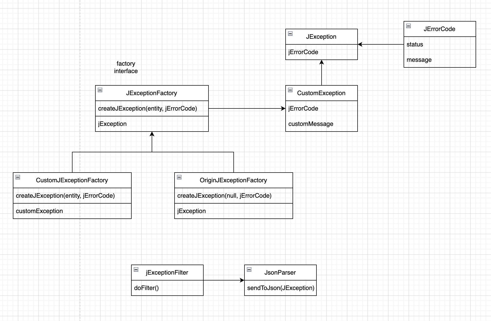

# spring-j-exception

> This project is an open source project and I am looking forward to your issues.

<br>

**Resolve over 1500 JException related runtime exceptions that exist in a spring framework.**


## Description

spring-j-exception is designed to reduce the inconvenience of handling redundant exceptions and creating error codes by creating a new exception class and wrapping HTTP-related exceptions with runtime exceptions.

The `JExceptionFactory` class makes it easy to handle custom HTTP-related exceptions.

The inconvenient task of inserting exception information into the **HttpServletResponse using the exception filter can be easily handled by registering JExceptionFilter as blank.**

JException provides all exception classes for HTTP methods from 400 to 500. Additionally, **you can create a domain name by adding it to an associated exception to handle domain names and HTTP-related exceptions.**


## Feature

### JExceptionFactory

In this way, you can create a JException using the JExceptionFactory.

```kt
class Service {
    fun execute() {
        val customException = CustomExceptionFactory.createJException(entity, JErrorCode.NOT_FOUND_J)
        val originJException404 = OriginExceptionFactory.createJException(null, JErrorCode.NOT_FOUND_J)
        
        if(condition) {
            throw customException
        } else {
            throw originException404
        }
    }
}

@Configuration
class JConfiguration {

    @Bean
    fun jExceptionFactory() = CustomJExceptionFactory()
    
    @Bean
    fun jExceptionFactory() = originJExceptionFactory()
}

```


### JExceptionFilter

```kt
@Configuration
class JConfiguration {
    
    @Bean
    fun jexceptionFilter() = JexceptionFilter()
    
}

```

### Diagram




